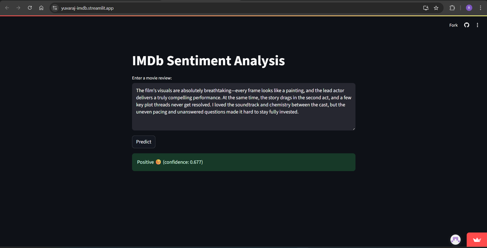

# IMDb Sentiment Analysis Web App

A simple, interactive web application that uses a Bidirectional LSTM model trained on the IMDb dataset to classify movie reviews as positive or negative. Built with TensorFlow/Keras and deployed with Streamlit.

Try it out online:  
👉 [https://yuvaraj-imdb-app.streamlit.app/](https://yuvaraj-imdb-app.streamlit.app/)


---

## 📋 Project Overview

This repository contains:

- **`train_model.py`**  
  Python script to load the IMDb dataset, train a Bidirectional LSTM model for sentiment classification, and export:
  - `sentiment_rnn1.h5` — the trained model weights  
  - `tokenizer.json` — the word-index mapping for preprocessing  

- **`app.py`**  
  A Streamlit application that:
  1. Rebuilds the exact same model architecture in code  
  2. Loads the saved weights and tokenizer  
  3. Provides a web UI for users to enter a review, click **Predict**, and immediately see the sentiment with confidence  

- **`tokenizer.json`**  
  JSON-serialized tokenizer used to vectorize incoming text.

- **`sentiment_weights.h5`**  
  HDF5 file containing only the trained model weights.

- **`screenshots/`**  
  - `app_output.png` — a sample screenshot of the running app showing a “mixed” review and its predicted sentiment.  

---

## 🚀 Live Demo



---

## 🛠️ Installation & Setup

1. **Clone the repo**  
   ```bash
   git clone https://github.com/<your-username>/imdb-sentiment-streamlit.git
   cd imdb-sentiment-streamlit
   ```

2. **Create & activate a virtual environment (optional, but recommended)**

   ```bash
   python3 -m venv venv
   source venv/bin/activate    # macOS/Linux
   venv\Scripts\activate       # Windows
   ```

3. **Install dependencies**
   
   ```bash
   pip install -r requirements.txt
   ```

4. **Run the app locally**
   ```bash
   streamlit run app.py
   ```

## 🧩 File Structure

```text
imdb-sentiment-streamlit/
├── app.py                 # Streamlit frontend
├── train_model.py         # Training & export script
├── tokenizer.json         # Tokenizer config
├── sentiment_weights.h5   # Trained weights
├── requirements.txt       # Python dependencies
└── screenshots/
    └── app_output.png     # Sample UI screenshot
```


## 📈 How It Works

### Training
- Load the IMDb reviews and labels  
- Fit a `Tokenizer` on the text, convert to padded sequences  
- Build a `Sequential` model with two bidirectional LSTM layers  
- Train with early stopping and save only the best weights  

### Deployment
- In `app.py`, reconstruct the model architecture (same hyperparameters!)  
- Call `model.build((None, MAX_LEN))` to initialize shape inference  
- Load the weights via `model.load_weights('sentiment_weights.h5')`  
- Preprocess user input with the JSON tokenizer, run `model.predict()`, and display the result  
